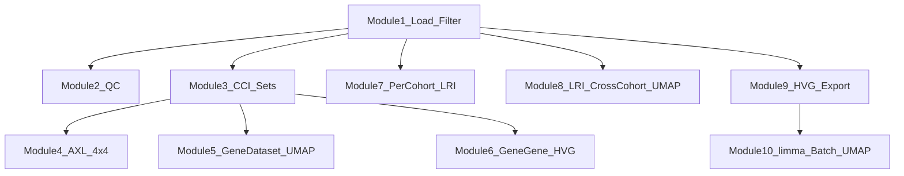

# Cross-Cohort Differential Communication Phenotypes (H&N)

Methods documentation for the cross-cohort scDiffCom post-analysis pipeline. Suitable for adaptation in a thesis Methods section. Complements the within-cohort module documented in [`within_cohort/METHODS.md`](within_cohort/METHODS.md).

---

## Overview

To compare **differential cell–cell communication (dCCC) phenotypes across multiple HNSC cohorts**, we built a cross-cohort post-analysis pipeline downstream of per-gene scDiffCom runs. Whereas the within-cohort module characterizes how each gene reshapes signaling **inside one tumor dataset**, the cross-cohort module asks:

1. Does the same gene perturbation induce **similar CCI programs** in different HNSC studies?
2. Do **gene×dataset** points cluster by cohort (batch) or by biological similarity?
3. Which **highly variable CCIs** drive consensus structure after accounting for dataset effects?

The pipeline is implemented in R ([`index.Rmd`](index.Rmd), sections 01–10, helpers in `R/02_cci_helpers.R` and `R/03_lri_helpers.R`) and currently targets **four HNSC scRNA-seq cohorts**: Kurten_HNSC, Puram_HNSC, Choi_HNSC, and Bill_HNSC.

Each analysis point is typically a **Gene × Dataset** pair (e.g. `AXL_Kurten`), carrying that gene’s malignant dCCC profile in that cohort.

---

## Relationship to within-cohort analysis

| Aspect | Within-cohort | Cross-cohort (this pipeline) |
|--------|---------------|------------------------------|
| Unit of comparison | Genes within one dataset | Genes across datasets; Gene×Dataset points |
| Primary feature | LRI-averaged LOGFC vectors | CCI sets (top-N or ranked); optional LRI LOGFC |
| Distances | Cosine similarity (LRI space) | Jaccard; Average Overlap (SuperRanker) |
| Batch effects | Not modeled | MNN (`batchelor`) and `limma::removeBatchEffect` |
| Typical figures | AXL boxplot, gene UMAP per cohort | 4×4 GOI heatmaps, global UMAPs, gene–gene heatmaps |

Both modules share the same upstream scDiffCom objects and malignant filtering logic (Module 1).

---

## Upstream inputs and shared preprocessing (Module 1)

**scDiffCom objects.** For each cohort \(d \in \{\text{Kurten}, \text{Puram}, \text{Choi}, \text{Bill}\}\) and gene \(g\), we loaded `{g}_{d}_scDiffCom.rds` from `split-by-rank-genes-v2`.

**Malignant DE filter.** From `cci_table_detected`, rows were retained if Tumor was emitter or receiver, `IS_CCI_DE == TRUE`, and LOGFC was finite—identical to within-cohort Module 1.

**Cell-type quality filter.** Interactions involving unknown, equivocal, other, or **multi** cell-type labels were removed (cross-cohort filter is slightly broader than within-cohort, which excludes multi explicitly in the unknown pattern).

**Shared gene panel.** Only genes present in **all four** cohorts after filtering were retained (`Top.N.HN.Genes` = set intersection). All downstream cross-cohort matrices use this common gene panel so that missing genes do not induce artificial distance inflation.

**Output:** four lists \(\{ T^{(g)}_d \}\) for \(g \in \mathcal{G}_{\cap}\), \(d \in \mathcal{D}\).

---

## Module 2: Quality control (cell-type noise)

**Purpose.** Quantify how much of each cohort’s interaction catalogue is attributable to ambiguous cell-type annotations before filtering.

**Method.** On pre-filter tables (`.malignant.orig`), we counted interactions where emitter or receiver matched the unknown/equivocal/other/multi pattern. Results were aggregated per dataset and visualized as stacked bar charts (clean vs noisy interactions).

**Role in Methods.** QC supports interpretation of cohort-specific gaps in Jaccard heatmaps; it does not alter downstream distance matrices.

---

## Module 3: CCI set representations

The cross-cohort pipeline represents each gene’s dCCC phenotype primarily as a **set of CCI identifiers** (full ligand–receptor–emitter–receiver tuples), ranked by perturbation effect magnitude.

### 3.1 CCI definition

A **CCI** is the scDiffCom interaction key (ligand–receptor pair combined with emitter and receiver cell types). It is more resolved than an **LRI** (ligand–receptor pair alone), which the pipeline uses in separate LRI-space modules (§7–8).

### 3.2 Top-N CCI sets (Jaccard representation)

For each gene \(g\) and cohort \(d\), malignant DE rows were sorted by \(|\text{LOGFC}|\) descending. The **top 500** CCIs were retained:

\[
S^{(g)}_{d,\text{top500}} = \text{top-500 CCIs by } |\text{LOGFC}| \text{ in } T^{(g)}_d
\]

These sets power **Jaccard distance** analyses (Modules 4–6).

### 3.3 Full ranked CCI lists (Average Overlap representation)

The complete ordered CCI list per gene and cohort (no truncation) was also stored:

\[
S^{(g)}_{d,\text{ranked}} = \text{all CCIs in } T^{(g)}_d \text{ ordered by } |\text{LOGFC}|
\]

These lists power **Average Overlap (AO)** distance via the SuperRanker package, which compares ranked lists rather than binary membership.

**Interpretation.** Top-500 Jaccard emphasizes the strongest perturbation signals; full-list AO retains rank-sensitive concordance across the entire detected programme.

---

## Distance metrics

### Jaccard distance

For finite sets \(A, B\):

\[
d_J(A,B) = 1 - \frac{|A \cap B|}{|A \cup B|}
\]

\(d_J = 0\) indicates identical CCI sets; \(d_J = 1\) indicates no overlap. Diagonal/self-comparisons are undefined (NA). Missing gene in a cohort is treated as NA and displayed as maximum distance in heatmaps.

**Efficient implementation.** For large Gene×Dataset collections, Jaccard distance on binary CCI membership matrices was computed via matrix multiplication (`tcrossprod`) over a union CCI vocabulary.

### Average Overlap distance

For ranked lists \(L_1, L_2\), lists were padded to equal length with unique placeholders, converted to rank matrices, and compared with `SuperRanker::average_overlap`. Similarity was averaged over the top-\(k\) ranks (\(k = \max(|L_1|,|L_2|)\)); distance \(= 1 - \text{similarity}\). This metric is rank-aware and uses **full** ranked lists, not top-500 truncation.

---

## Module 4: Gene-of-interest cross-cohort comparison (AXL)

**Purpose.** Summarize how one gene’s dCCC phenotype **varies across the four HNSC cohorts**.

**Gene of interest.** Default: **AXL** (`GENE_OF_INT`).

**Analyses.**

1. **4×4 Jaccard heatmap** — pairwise Jaccard distance between cohorts using \(S^{(\text{AXL})}_{d,\text{top500}}\). Hierarchical clustering on distances; cell annotations show numeric distances; N/A for absent data.
2. **4×4 Average Overlap heatmap** — same layout using full ranked lists \(S^{(\text{AXL})}_{d,\text{ranked}}\).

**Derived objects.** Distance matrices and list-matrices of **mutual CCIs** per cohort pair (intersection of top-500 sets) for qualitative inspection.

**Interpretation.** Low Jaccard/AO distance between cohorts \(d_1, d_2\) indicates that AXL perturbation reproduces a **conserved cross-cohort dCCC programme**; high distance indicates cohort-specific remodeling.

---

## Module 5: Global Gene × Dataset embedding (CCI Jaccard / AO)

**Purpose.** Embed all **Gene × Dataset** pairs in two dimensions to visualize global structure of dCCC phenotypes and **cohort-driven batch effects**.

### 5.1 Binary CCI membership representation

Let \(\mathcal{C}\) be the union of all top-500 CCIs across included cohorts. Each Gene×Dataset pair \((g,d)\) maps to a binary vector \(\mathbf{b}_{g,d} \in \{0,1\}^{|\mathcal{C}|}\), where \(b_c = 1\) if CCI \(c \in S^{(g)}_{d,\text{top500}}\).

Rows of the matrix \(B\) are Gene×Dataset labels (e.g. `AXL_Kurten`); columns are CCIs.

### 5.2 Jaccard distance graph

Pairwise Jaccard distances \(d_J(\mathbf{b}_{g_1,d_1}, \mathbf{b}_{g_2,d_2})\) form a distance matrix over all non-empty Gene×Dataset points. **UMAP** (`uwot`, `n_neighbors = 15`, `min_dist = 0.1`, seed = 42) projects this space into 2D. Points are colored by **dataset (source)** and shaped by cancer type (H&N).

### 5.3 MNN batch correction (Jaccard)

To reduce cohort-specific technical variation, **`batchelor::fastMNN`** was applied to the transposed binary matrix with `batch = dataset`. The corrected embedding was projected with UMAP (same parameters). This separates **biological** Gene×Dataset similarity from **technical** dataset identity when possible.

### 5.4 Average Overlap global UMAP

The full pairwise AO distance matrix over Gene×Dataset ranked lists was computed (computationally intensive). UMAP was applied to AO distances. **MNN on AO** used classical MDS coordinates of the AO distance matrix as input to `fastMNN`, then UMAP on corrected coordinates.

### 5.5 AXL cross-dataset CCI inventory

For AXL, the pipeline reports union CCIs, CCIs conserved in all four cohorts, and cohort-unique CCIs, plus a pairwise mutual-CCI table derived from the global intersection catalogue.

**Interpretation.** If Gene×Dataset points cluster by **dataset color** before MNN but mix after correction, batch effects dominate raw CCI profiles; conserved biological clusters appear as gene groups that persist across colors.

---

## Module 6: Gene × Gene consensus analysis (HVG-restricted Jaccard / AO)

**Purpose.** Identify **groups of cancer genes** that induce similar dCCC programmes **across all HNSC cohorts combined**, using a consensus CCI vocabulary restricted to highly variable interactions.

### 6.1 Highly variable CCI (HVG) selection for gene–gene analysis

A Gene×Dataset × CCI matrix of **LOGFC values** was built (NA where a CCI is absent for that gene in that cohort). For each CCI column, cross-Gene×Dataset variance was computed on non-NA entries. CCIs observed in fewer than **10** Gene×Dataset rows were excluded. The **top 5%** highest-variance CCIs were retained as **HVG CCIs** for gene–gene analysis (parameter `GENE_GENE_TOP_VAR_CCI_PCT = 0.05`).

**Rationale.** HVG restriction focuses gene–gene comparison on interactions whose perturbation effect **differs most across the multi-cohort screen**, reducing dominance by universally detected but uninformative CCIs.

### 6.2 Per-gene union CCI sets (HVG-restricted)

For each gene \(g\), union top-500 CCIs were taken across cohorts, then intersected with HVG:

\[
U_g = \left( \bigcup_{d} S^{(g)}_{d,\text{top500}} \right) \cap \mathcal{C}_{\text{HVG}}
\]

Genes were ranked by \(|U_g|\); the **top 400** genes by union HVG CCI count entered the gene–gene matrix.

### 6.3 Gene × Gene Jaccard heatmap

Binary matrix over HVG union CCIs → Jaccard distances between genes → hierarchical clustering heatmap (`gene_gene_jaccard_heatmap_h&n.png`).

### 6.4 Gene × Gene Average Overlap

Consensus ranked CCI lists per gene were built across cohorts: CCIs appearing in more cohorts rank higher; ties broken by mean rank position; restricted to HVG. Pairwise AO distances among top 400 genes → heatmap (`gene_gene_ao_heatmap_h&n.png`).

**Interpretation.** Gene–gene clusters reveal **functional modules of perturbation** (e.g. immune, proliferation, ECM genes) that co-perturb similar CCI programmes across the multi-cohort HNSC compendium.

---

## Module 7: Per-cohort LRI gene–gene heatmaps (reference)

For each HNSC cohort separately, the pipeline generates **within-cohort** gene–gene cosine similarity heatmaps in **LRI LOGFC space** (same logic as `within_cohort` Module 3, via `plot_lri_heatmap_umap`). These are stored alongside cross-cohort outputs for direct comparison but are **not** themselves cross-cohort integrations.

---

## Module 8: Cross-cohort Gene × Dataset UMAP in LRI space

**Purpose.** Complement CCI-set analysis with a **continuous LRI-level** embedding comparable to within-cohort gene UMAPs, but with points defined as Gene×Dataset rather than genes alone.

**Representation.**

1. Per cohort \(d\), build LRI × gene LOGFC matrix \(M_d\) (LRI-averaged LOGFC, sparse LRIs filtered at ≥2 genes).
2. Union LRI space \(\mathcal{L}_\cup\) across cohorts.
3. Each Gene×Dataset row: vector of LOGFC values over \(\mathcal{L}_\cup\) (NA → 0 for UMAP input only).

**Embedding.** UMAP with **cosine** metric (`n_neighbors = 15`, `min_dist = 0.1`). Points colored by dataset.

**Interpretation.** Shows whether the same gene’s **LRI-level** perturbation signature is cohort-stable or cohort-specific, independent of binary top-500 CCI membership.

---

## Module 9: HVG CCI catalogue export

**Purpose.** Document which CCIs exhibit the highest cross-Gene×Dataset LOGFC variance (batch-agnostic feature selection step).

**Method.** Same Gene×Dataset × CCI LOGFC matrix as §6.1, with **top 10%** variance cutoff (`TOP_VAR_CCI_PCT = 0.1`) and minimum 10 observations per CCI. Exported: `cci_hvg_variance_ranking_h&n.csv` (CCI, variance, n_obs, is_hvg flag).

**Downstream use.** Informs Module 10 and gene–gene HVG restriction (which uses 5% in §6; parameters differ intentionally between export vs clustering stringency).

---

## Module 10: limma batch correction and validation UMAPs (CCI space)

**Purpose.** Remove **dataset (cohort) batch effects** on CCI LOGFC profiles while preserving gene-contrast signal, then verify mixing in UMAP space.

### 10.1 Feature matrix

Gene×Dataset × HVG CCI matrix of LOGFC values (`feat_mat_hvg`), with NA for absent interactions.

### 10.2 Imputation and limma correction

Column-wise means imputed for NA entries (limma input only). **`limma::removeBatchEffect`** was applied with:

- `batch = dataset` (four HNSC cohorts)
- `mod = model.matrix(~ gene)` when possible (gene effect preserved); fallback to batch-only correction on failure

Output: `feat_mat_cci_corrected` — batch-adjusted LOGFC matrix.

### 10.3 Validation UMAPs (three panels)

| Panel | Input matrix | Subtitle meaning |
|-------|--------------|------------------|
| Raw | All union CCIs, NA→0 for UMAP | Cohort structure often visible |
| HVG | Top 5% variable CCIs only | Focused biological signal |
| Corrected | HVG + limma batch removal | Cohort mixing if correction succeeds |

Saved as `gene_dataset_cci_umap_{raw,hvg,corrected}_h&n.png`. Full matrices saved to `cci_post_analysis_matrices_h&n.rds`.

**Interpretation.** Convergence of corrected UMAP toward gene-centric rather than dataset-centric clusters supports that cross-cohort dCCC comparison identifies **shared perturbation biology** after accounting for study-specific technical variation.

---

## Representations summary

| Representation | Dimensions | Encodes | Modules |
|----------------|------------|---------|---------|
| Filtered DE tables \(T^{(g)}_d\) | interactions × metadata | Full malignant dCCC per gene×cohort | 1, all |
| Top-500 CCI set \(S^{(g)}_{d,\text{top500}}\) | set | Strongest perturbation CCIs | 3–6 |
| Ranked CCI list \(S^{(g)}_{d,\text{ranked}}\) | ordered set | Full programme with rank | 4–6 (AO) |
| Binary CCI vector \(\mathbf{b}_{g,d}\) | \(|\mathcal{C}|\) | Membership in top-500 universe | 5 |
| Gene×Dataset × CCI LOGFC | pairs × CCIs | Continuous perturbation | 6, 9, 10 |
| HVG CCI subset \(\mathcal{C}_{\text{HVG}}\) | CCI IDs | High cross-cohort variance | 6, 9, 10 |
| LRI × gene LOGFC \(M_d\) | LRIs × genes | LRI-level phenotype per cohort | 7–8 |
| Gene×Dataset × LRI LOGFC | pairs × LRIs | Cross-cohort LRI embedding | 8 |
| Jaccard / AO distance matrices | various | Set/rank similarity | 4–6 |
| limma-corrected LOGFC | pairs × HVG CCIs | Batch-adjusted phenotype | 10 |

---

## Parameters and software

| Parameter | Value |
|-----------|--------|
| Cohorts | Kurten_HNSC, Puram_HNSC, Choi_HNSC, Bill_HNSC |
| Malignant cell type | Tumor |
| Top CCIs per gene (Jaccard) | 500 |
| Top genes (gene–gene heatmap) | 400 |
| HVG CCI % (gene–gene) | 5% |
| HVG CCI % (export §9) | 10% |
| Min Gene×Dataset obs per CCI | 10 |
| UMAP `n_neighbors` | 15 |
| UMAP `min_dist` | 0.1 |
| UMAP / clustering seed | 42 |
| Gene of interest | AXL |
| Min genes per LRI (§7–8) | 2 |

**Software:** R (tidyverse, scDiffCom, ggplot2, ggrepel, pheatmap, uwot, SuperRanker, batchelor, limma, igraph where applicable).

**Code:** `Thesis/CCC/scripts/scDiffCom/post_analysis/`

**Outputs:** `~/Thesis/CCC/outputs/scDiffCom/plots/v6/` (and `plots/v2/qualityCheck/` for QC)

---

## Main output files (H&N)

| File | Module |
|------|--------|
| `AXL_jaccard_umap.png` | 4 — GOI Jaccard heatmap |
| `AXL_ao_heatmap.png` | 4 — GOI AO heatmap |
| `global_jaccard_umap_h&n.png` | 5 — Gene×Dataset UMAP |
| `global_jaccard_mnn_umap_h&n.png` | 5 — Jaccard + MNN |
| `global_ao_umap_h&n.png` | 5 — AO UMAP |
| `global_ao_mnn_umap_h&n.png` | 5 — AO + MNN |
| `gene_gene_jaccard_heatmap_h&n.png` | 6 — Gene×gene Jaccard |
| `gene_gene_ao_heatmap_h&n.png` | 6 — Gene×gene AO |
| `{cohort}_lri_heatmap.png` | 7 — Per-cohort LRI heatmap |
| `gene_dataset_lri_umap_h&n.png` | 8 — Cross-cohort LRI UMAP |
| `cci_hvg_variance_ranking_h&n.csv` | 9 — HVG table |
| `cci_post_analysis_matrices_h&n.rds` | 10 — limma matrices |
| `gene_dataset_cci_umap_{raw,hvg,corrected}_h&n.png` | 10 — Validation UMAPs |

---

## Suggested thesis subsection structure

1. **Cross-cohort differential communication analysis** (overview, cohorts, shared gene panel)
2. **CCI set representations and distance metrics** (Jaccard vs Average Overlap)
3. **Gene-of-interest conservation** (AXL 4×4 heatmaps)
4. **Global Gene×Dataset embedding and batch correction** (Jaccard/AO UMAP, MNN)
5. **Consensus gene–gene structure** (HVG-restricted heatmaps)
6. **LRI-space cross-cohort embedding** (optional, parallels within-cohort)
7. **limma batch correction on CCI LOGFC** (HVG selection + validation UMAPs)

---

## Pipeline flow

---

## Example Results sentence (template)

> Across four HNSC cohorts and [G] shared cancer genes, we compared dCCC phenotypes using the top 500 differentially perturbed CCIs per gene×cohort. Global Gene×Dataset UMAP of Jaccard distances revealed [describe dataset clustering]. After MNN batch correction / limma adjustment on the top 5% highest-variance CCIs, [describe improved mixing / persistent structure]. AXL exhibited [low/moderate/high] cross-cohort Jaccard distances between [cohorts], with [N] CCIs conserved in all four studies. Gene–gene clustering on HVG-restricted CCI sets identified [K] gene modules associated with distinct perturbation programmes.

Replace bracketed values from pipeline logs and output tables.
